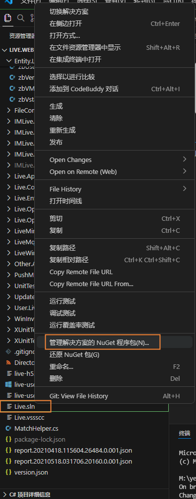
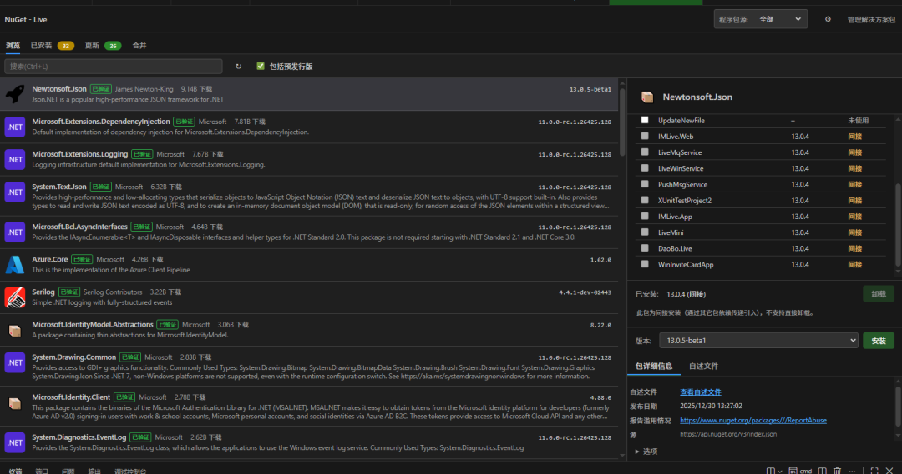

# NuGet (Solution)

在 VS Code 中提供与 **Visual Studio 2026** 几乎一致的**解决方案级 NuGet 包管理体验**。无需切换窗口，直接在编辑器里浏览、安装、更新、卸载解决方案所引用的 NuGet 包。

## 核心特性

- **解决方案级管理**
  在资源管理器中右键 `.sln`、`.csproj`、`.fsproj` 或任意文件夹，选择 **「管理解决方案的 NuGet 程序包(N)...」**，即可打开与该解决方案绑定的包管理面板。

- **与 Visual Studio 一致的交互**
  - 顶部页签：**浏览 / 已安装 / 更新 / 合并**
  - 左侧包列表：包名、作者、下载量、最新版本一目了然
  - 右侧详情区：包 ID、作者、版本、官方源链接、详细描述
  - 底部翻页：上一页 / 下一页，按需拉取更多包

- **多程序包源**
  默认提供 `nuget.org`，可添加内网程序包源（如 BaGet / Artifactory）。内网 HTTP 明文源可通过 `allowInsecureConnections: true` 放行。

- **当前源即时切换**
  面板顶部下拉框可随时切换「全部源」或指定源。

- **预发行版开关**
  勾选「包含预发行版」即可浏览 `-beta` / `-preview` / `-rc` 等预发布版本。

- **一键还原**
  右键 `.sln` 选择「还原 NuGet 包(G)」，即可还原解决方案引用的全部包。

- **可配置默认值**
  默认激活页签、默认程序包源、是否含预发行版、dotnet CLI 路径均可按需配置。

## 界面预览

右键 `.sln` 文件，在资源管理器菜单中选择「管理解决方案的 NuGet 程序包(N)...」：



打开的包管理面板与 Visual Studio 布局一致，左侧包列表、右侧详情一目了然：



## 使用步骤

1. 用 VS Code 打开包含 `.sln`（或任意 `.csproj` / `.fsproj` / 文件夹）的工作区。
2. 在资源管理器中右键 `.sln` 文件，选择 **「管理解决方案的 NuGet 程序包(N)...」**。
3. 在打开的「NuGet (Solution)」面板中：
   - 切到 **浏览**：搜索并安装新包
   - 切到 **已安装**：查看当前解决方案引用，支持卸载
   - 切到 **更新**：一键升级解决方案中各包的版本
4. 选中包后，在右侧查看详情、选择版本，点击 **安装 / 更新 / 卸载**。

## 设置项

打开「设置」搜索 `nuget-vscode`，或直接在 `settings.json` 中配置：

| 设置项 | 类型 | 默认值 | 说明 |
| ------ | ---- | ------ | ---- |
| `nuget-vscode.sources` | array | `nuget.org` + 示例内网源 | 程序包源列表；`allowInsecureConnections: true` 允许 HTTP 明文连接 |
| `nuget-vscode.activeSource` | string | `nuget.org` | 当前激活程序包源；`__all__` 表示全部源 |
| `nuget-vscode.defaultSource` | string | `nuget.org` | 打开面板时默认选中源；`__all__` 表示全部源 |
| `nuget-vscode.includePrerelease` | boolean | `false` | 浏览/已安装/更新列表是否包含预发行版 |
| `nuget-vscode.defaultTab` | `updates` / `browse` / `installed` | `browse` | 打开面板时默认激活页签 |
| `nuget-vscode.dotnetPath` | string | `""` | `dotnet` CLI 绝对路径；留空按 `PATH` 自动查找 |

## 环境要求

- VS Code `^1.85.0` 及以上
- 「还原」等部分操作依赖 `dotnet` CLI（自动检测，或用 `nuget-vscode.dotnetPath` 显式指定）
- 内网 HTTP 源需在源配置中显式开启 `allowInsecureConnections`

## 本地开发与调试

### 前置要求

- Node.js 18+（推荐 20+）与 npm
- VS Code `^1.85.0`

### 1. 安装依赖

根目录与 `webview-ui` 子包依赖相互独立，需要分别安装：

```bash
npm install
cd webview-ui && npm install
```

### 2. 构建

```bash
npm run build
```

| 脚本 | 作用 |
| ---- | ---- |
| `npm run build:webview` | 用 Vite 构建 Webview UI 到 `dist/webview` |
| `npm run build:ext` | 用 esbuild 打包扩展主进程到 `dist/extension.js` |
| `npm run build` | 上述两步（默认构建任务） |
| `npm run watch:webview` | Webview 监听模式，改动自动重建 |
| `npm run watch:ext` | 扩展主进程监听模式，改动自动重建 |

### 3. 启动调试（推荐）

> 仓库不包含 `.vscode` 目录，首次调试请先在仓库根目录创建下面两个文件。

**`.vscode/tasks.json`**（把 `npm run build` 注册为默认构建任务）：

```json
{
  "version": "2.0.0",
  "tasks": [
    {
      "label": "Build All",
      "type": "npm",
      "script": "build",
      "group": { "kind": "build", "isDefault": true },
      "problemMatcher": []
    }
  ]
}
```

**`.vscode/launch.json`**（扩展开发宿主调试配置）：

```json
{
  "version": "0.2.0",
  "configurations": [
    {
      "name": "Run NuGet Extension",
      "type": "extensionHost",
      "request": "launch",
      "args": [
        "--extensionDevelopmentPath=${workspaceFolder}"
      ],
      "outFiles": [
        "${workspaceFolder}/dist/extension.js",
        "${workspaceFolder}/dist/webview/assets/index.js"
      ],
      "preLaunchTask": "${defaultBuildTask}"
    }
  ]
}
```

> 若希望宿主启动后自动打开某个测试项目，在 `args` 中追加它的目录路径即可，例如：
> `"args": ["--extensionDevelopmentPath=${workspaceFolder}", "D:/projects/MySolution"]`。

然后：

1. 用 VS Code 打开本仓库目录（`nuget-vscode`）。
2. 按 <kbd>F5</kbd>，或在「运行和调试」面板选择 **Run NuGet Extension**。
   - 会先自动执行默认构建任务 `npm run build`
   - 随后弹出「扩展开发宿主」窗口，扩展即在该窗口中生效
3. 在宿主窗口里打开任意包含 `.sln` / `.slnx` / `.csproj` 的项目，在资源管理器中右键选择 **「管理解决方案的 NuGet 程序包(N)...」** 即可打开面板。

### 4. 修改代码后如何生效

- **扩展主进程（`src/`）**：保存后重新按 <kbd>F5</kbd>，或在宿主窗口执行 `Developer: Reload Window`。
- **Webview UI（`webview-ui/`）**：需重新生成产物。建议开两个监听终端：
  - 终端 1：`npm run watch:webview`
  - 终端 2：`npm run watch:ext`
  - 然后在宿主窗口执行 `Developer: Reload Window`。

### 5. 调试 Webview 界面

在**扩展开发宿主窗口**（不是本仓库窗口）中执行：

- 命令面板 → `Developer: Toggle Developer Tools`，可查看 Webview 的 Console 报错、网络请求与 DOM。
- 主进程日志可打开「输出」面板，选择 `NuGet` 相关频道查看。

### 6. 打包为 VSIX 安装验证

```bash
npx @vscode/vsce package
```

然后在 VS Code 扩展面板右上角 `...` → **Install from VSIX…** 选择生成的 `nuget-vscode-x.y.z.vsix`，重载窗口即可（适合在不启动调试宿主的日常环境中验证）。

## 反馈与支持

如遇问题或想提建议，欢迎在仓库提交 issue。若面板无法加载，请先检查所选程序包源是否可达、是否需要开启 `allowInsecureConnections`。
